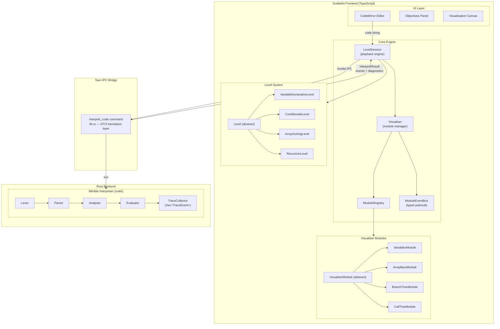

```mermaid
graph TB
    subgraph Frontend["SvelteKit Frontend (TypeScript)"]
        subgraph UI["UI Layer"]
            Editor["CodeMirror Editor"]
            ObjectivesPanel["Objectives Panel"]
            VisCanvas["Visualisation Canvas"]
        end

        subgraph Core["Core Engine"]
            LS["LevelSession\n(playback engine)"]
            VIS["Visualiser\n(module manager)"]
            REG["ModuleRegistry"]
            BUS["ModuleEventBus\n(typed pub/sub)"]
        end

        subgraph Levels["Level System"]
            LevelBase["Level (abstract)"]
            VarDecl["VariableDeclarationLevel"]
            Conditionals["ConditionalsLevel"]
            ArraySort["ArraySortingLevel"]
            Recursion["RecursionLevel"]
        end

        subgraph Modules["Visualiser Modules"]
            ModBase["VisualiserModule (abstract)"]
            VarMod["VariablesModule"]
            ArrMod["ArrayBarsModule"]
            BranchMod["BranchTreeModule"]
            CallMod["CallTreeModule"]
        end
    end

    subgraph Bridge["Tauri IPC Bridge"]
        CMD["interpret_code command\nlib.rs — DTO translation layer"]
    end

    subgraph Backend["Rust Backend"]
        subgraph Mimble["Mimble Interpreter (crate)"]
            Lexer --> Parser --> Analyser --> Evaluator
            Evaluator --> Tracer["TraceCollector\n(Vec&lt;TraceEvent&gt;)"]
        end
    end

    Editor -->|code string| LS
    LS -->|invoke IPC| CMD
    CMD -->|InterpretResult\nevents + diagnostics| LS
    CMD -->|run| Mimble

    LS --> VIS
    VIS --> REG
    VIS --> BUS
    REG --> Modules
    LS --> Levels

    LevelBase --> VarDecl & Conditionals & ArraySort & Recursion
    ModBase --> VarMod & ArrMod & BranchMod & CallMod
```
