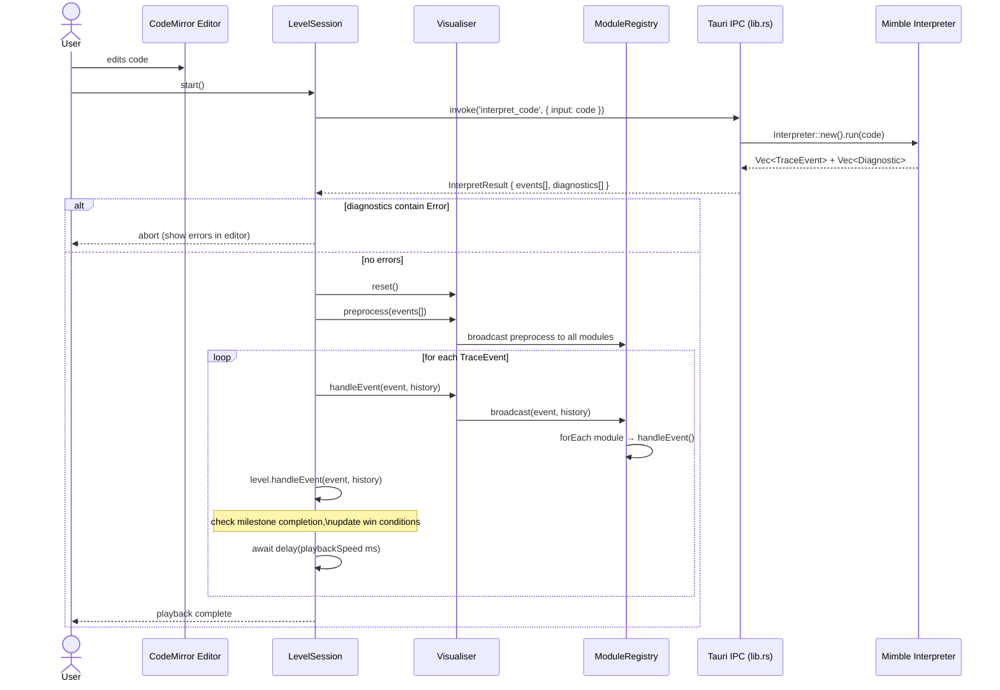

```mermaid
sequenceDiagram
    actor User
    participant Editor as CodeMirror Editor
    participant LS as LevelSession
    participant VIS as Visualiser
    participant REG as ModuleRegistry
    participant Tauri as Tauri IPC (lib.rs)
    participant Mimble as Mimble Interpreter

    User->>Editor: edits code
    User->>LS: start()

    LS->>Tauri: invoke('interpret_code', { input: code })
    Tauri->>Mimble: Interpreter::new().run(code)
    Mimble-->>Tauri: Vec<TraceEvent> + Vec<Diagnostic>
    Tauri-->>LS: InterpretResult { events[], diagnostics[] }

    alt diagnostics contain Error
        LS-->>User: abort (show errors in editor)
    else no errors
        LS->>VIS: reset()
        LS->>VIS: preprocess(events[])
        VIS->>REG: broadcast preprocess to all modules

        loop for each TraceEvent
            LS->>VIS: handleEvent(event, history)
            VIS->>REG: broadcast(event, history)
            REG->>REG: forEach module → handleEvent()

            LS->>LS: level.handleEvent(event, history)
            note over LS: check milestone completion,\nupdate win conditions

            LS->>LS: await delay(playbackSpeed ms)
        end

        LS-->>User: playback complete
    end
```
