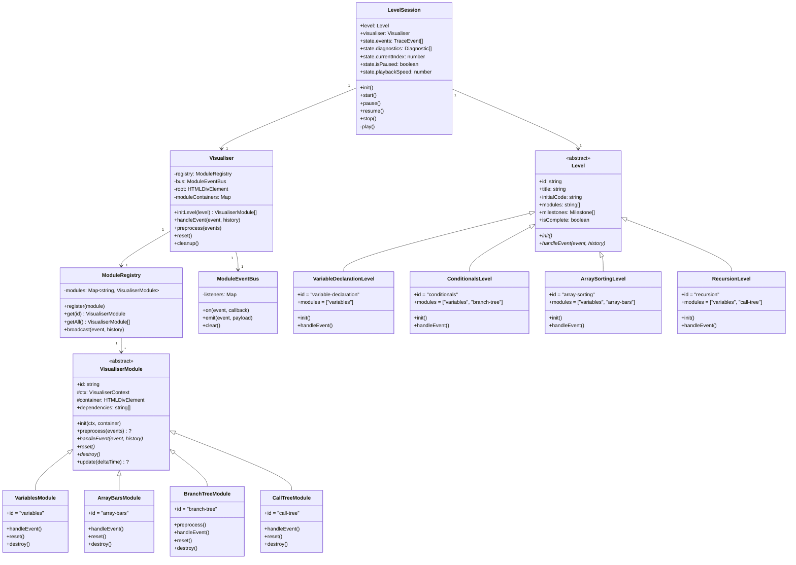

```mermaid
classDiagram
    class LevelSession {
        +level: Level
        +visualiser: Visualiser
        +state.events: TraceEvent[]
        +state.diagnostics: Diagnostic[]
        +state.currentIndex: number
        +state.isPaused: boolean
        +state.playbackSpeed: number
        +init()
        +start()
        +pause()
        +resume()
        +stop()
        -play()
    }

    class Visualiser {
        -registry: ModuleRegistry
        -bus: ModuleEventBus
        -root: HTMLDivElement
        -moduleContainers: Map
        +initLevel(level) VisualiserModule[]
        +handleEvent(event, history)
        +preprocess(events)
        +reset()
        +cleanup()
    }

    class ModuleRegistry {
        -modules: Map~string, VisualiserModule~
        +register(module)
        +get(id) VisualiserModule
        +getAll() VisualiserModule[]
        +broadcast(event, history)
    }

    class ModuleEventBus {
        -listeners: Map
        +on(event, callback)
        +emit(event, payload)
        +clear()
    }

    class Level {
        <<abstract>>
        +id: string
        +title: string
        +initialCode: string
        +modules: string[]
        +milestones: Milestone[]
        +isComplete: boolean
        +init()*
        +handleEvent(event, history)*
    }

    class VisualiserModule {
        <<abstract>>
        +id: string
        #ctx: VisualiserContext
        #container: HTMLDivElement
        +dependencies: string[]
        +init(ctx, container)
        +preprocess(events)?
        +handleEvent(event, history)*
        +reset()*
        +destroy()*
        +update(deltaTime)?
    }

    class VariablesModule {
        +id = "variables"
        +handleEvent()
        +reset()
        +destroy()
    }

    class ArrayBarsModule {
        +id = "array-bars"
        +handleEvent()
        +reset()
        +destroy()
    }

    class BranchTreeModule {
        +id = "branch-tree"
        +preprocess()
        +handleEvent()
        +reset()
        +destroy()
    }

    class CallTreeModule {
        +id = "call-tree"
        +handleEvent()
        +reset()
        +destroy()
    }

    class VariableDeclarationLevel {
        +id = "variable-declaration"
        +modules = ["variables"]
        +init()
        +handleEvent()
    }

    class ConditionalsLevel {
        +id = "conditionals"
        +modules = ["variables", "branch-tree"]
        +init()
        +handleEvent()
    }

    class ArraySortingLevel {
        +id = "array-sorting"
        +modules = ["variables", "array-bars"]
        +init()
        +handleEvent()
    }

    class RecursionLevel {
        +id = "recursion"
        +modules = ["variables", "call-tree"]
        +init()
        +handleEvent()
    }

    LevelSession "1" --> "1" Visualiser
    LevelSession "1" --> "1" Level

    Visualiser "1" --> "1" ModuleRegistry
    Visualiser "1" --> "1" ModuleEventBus
    ModuleRegistry "1" --> "*" VisualiserModule

    Level <|-- VariableDeclarationLevel
    Level <|-- ConditionalsLevel
    Level <|-- ArraySortingLevel
    Level <|-- RecursionLevel

    VisualiserModule <|-- VariablesModule
    VisualiserModule <|-- ArrayBarsModule
    VisualiserModule <|-- BranchTreeModule
    VisualiserModule <|-- CallTreeModule
```
