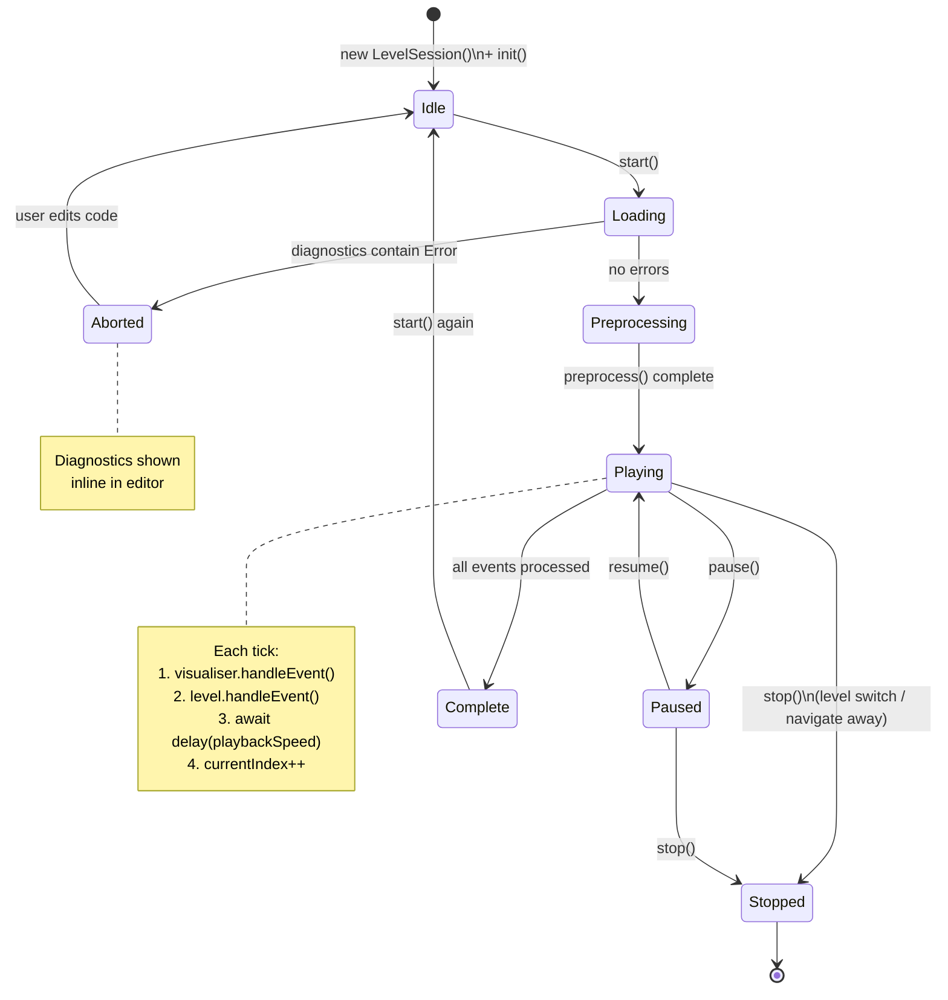

```mermaid
stateDiagram-v2
    [*] --> Idle : new LevelSession()\n+ init()

    Idle --> Loading : start()

    Loading --> Aborted : diagnostics contain Error
    Loading --> Preprocessing : no errors

    Aborted --> Idle : user edits code

    Preprocessing --> Playing : preprocess() complete

    Playing --> Paused : pause()
    Paused --> Playing : resume()

    Playing --> Stopped : stop()\n(level switch / navigate away)
    Paused --> Stopped : stop()

    Playing --> Complete : all events processed

    Stopped --> [*]
    Complete --> Idle : start() again

    note right of Playing
        Each tick:
        1. visualiser.handleEvent()
        2. level.handleEvent()
        3. await delay(playbackSpeed)
        4. currentIndex++
    end note

    note right of Aborted
        Diagnostics shown
        inline in editor
    end note
```
