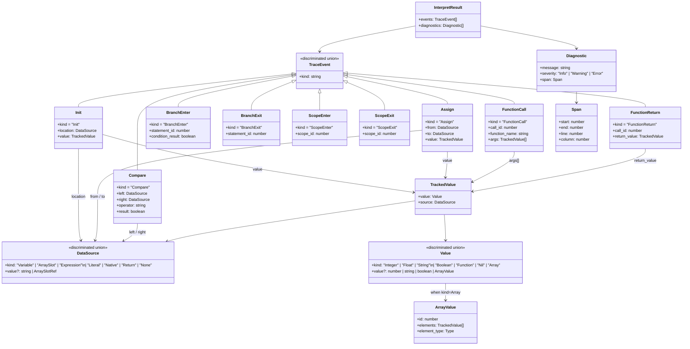

```mermaid
classDiagram
    class TraceEvent {
        <<discriminated union>>
        +kind: string
    }

    class Init {
        +kind = "Init"
        +location: DataSource
        +value: TrackedValue
    }

    class Assign {
        +kind = "Assign"
        +from: DataSource
        +to: DataSource
        +value: TrackedValue
    }

    class Compare {
        +kind = "Compare"
        +left: DataSource
        +right: DataSource
        +operator: string
        +result: boolean
    }

    class BranchEnter {
        +kind = "BranchEnter"
        +statement_id: number
        +condition_result: boolean
    }

    class BranchExit {
        +kind = "BranchExit"
        +statement_id: number
    }

    class ScopeEnter {
        +kind = "ScopeEnter"
        +scope_id: number
    }

    class ScopeExit {
        +kind = "ScopeExit"
        +scope_id: number
    }

    class FunctionCall {
        +kind = "FunctionCall"
        +call_id: number
        +function_name: string
        +args: TrackedValue[]
    }

    class FunctionReturn {
        +kind = "FunctionReturn"
        +call_id: number
        +return_value: TrackedValue
    }

    class TrackedValue {
        +value: Value
        +source: DataSource
    }

    class DataSource {
        <<discriminated union>>
        +kind: "Variable" | "ArraySlot" | "Expression"\n| "Literal" | "Native" | "Return" | "None"
        +value?: string | ArraySlotRef
    }

    class Value {
        <<discriminated union>>
        +kind: "Integer" | "Float" | "String"\n| "Boolean" | "Function" | "Nil" | "Array"
        +value?: number | string | boolean | ArrayValue
    }

    class ArrayValue {
        +id: number
        +elements: TrackedValue[]
        +element_type: Type
    }

    class Diagnostic {
        +message: string
        +severity: "Info" | "Warning" | "Error"
        +span: Span
    }

    class Span {
        +start: number
        +end: number
        +line: number
        +column: number
    }

    class InterpretResult {
        +events: TraceEvent[]
        +diagnostics: Diagnostic[]
    }

    TraceEvent <|-- Init
    TraceEvent <|-- Assign
    TraceEvent <|-- Compare
    TraceEvent <|-- BranchEnter
    TraceEvent <|-- BranchExit
    TraceEvent <|-- ScopeEnter
    TraceEvent <|-- ScopeExit
    TraceEvent <|-- FunctionCall
    TraceEvent <|-- FunctionReturn

    Init --> TrackedValue : value
    Init --> DataSource : location
    Assign --> TrackedValue : value
    Assign --> DataSource : from / to
    Compare --> DataSource : left / right
    FunctionCall --> TrackedValue : args[]
    FunctionReturn --> TrackedValue : return_value

    TrackedValue --> Value
    TrackedValue --> DataSource
    Value --> ArrayValue : when kind=Array
    Diagnostic --> Span
    InterpretResult --> TraceEvent
    InterpretResult --> Diagnostic
```
