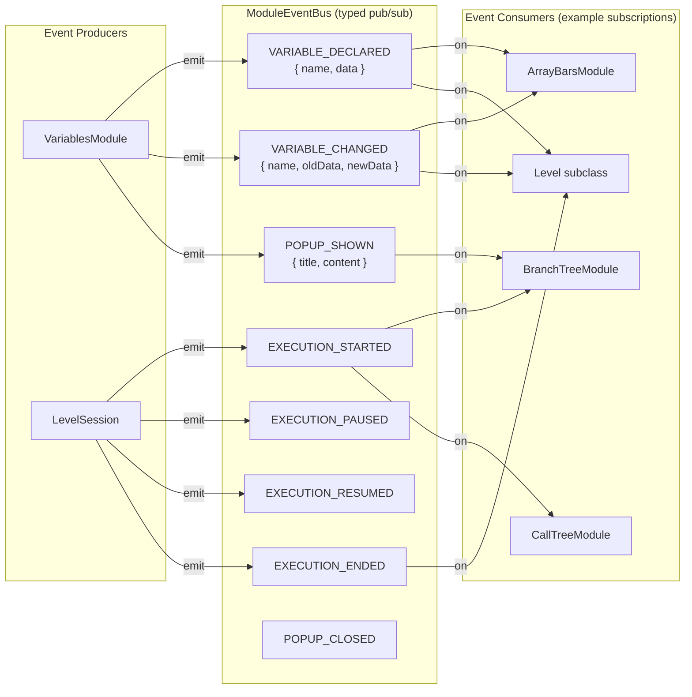

```mermaid
graph LR
    subgraph Producers["Event Producers"]
        VM["VariablesModule"]
        LS["LevelSession"]
    end

    subgraph Bus["ModuleEventBus (typed pub/sub)"]
        E1["VARIABLE_DECLARED\n{ name, data }"]
        E2["VARIABLE_CHANGED\n{ name, oldData, newData }"]
        E3["EXECUTION_STARTED"]
        E4["EXECUTION_PAUSED"]
        E5["EXECUTION_RESUMED"]
        E6["EXECUTION_ENDED"]
        E7["POPUP_SHOWN\n{ title, content }"]
        E8["POPUP_CLOSED"]
    end

    subgraph Consumers["Event Consumers (example subscriptions)"]
        ABM["ArrayBarsModule"]
        BTM["BranchTreeModule"]
        CTM["CallTreeModule"]
        Level["Level subclass"]
    end

    VM -->|emit| E1
    VM -->|emit| E2
    LS -->|emit| E3
    LS -->|emit| E4
    LS -->|emit| E5
    LS -->|emit| E6
    VM -->|emit| E7

    E1 -->|on| ABM
    E1 -->|on| Level
    E2 -->|on| ABM
    E2 -->|on| Level
    E3 -->|on| BTM
    E3 -->|on| CTM
    E6 -->|on| Level
    E7 -->|on| BTM
```
